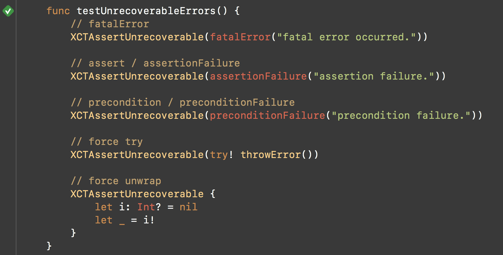

# XCTAssertUnrecoverable

  [](https://github.com/Carthage/Carthage) [](https://github.com/apple/swift-package-manager)

This library makes it possible to test that universal error / logic failure occurs, even if you use `fatalError`, `preconditionFailure` and so on. 



## Installation

`XCTAssertUnrecoverable` depends on [johnno1962/Fortify](https://github.com/johnno1962/Fortify), but it is included in this library directly to support CocoaPods, Carthage for now.

### [CocoaPods](https://guides.cocoapods.org/using/using-cocoapods.html)

```ruby
# Podfile
use_frameworks!

target 'YOUR_TESTING_TARGET' do
    pod 'XCTAssertUnrecoverable', '~> 1.0'
end
```

```bash
$ pod install
```

### [Carthage](https://github.com/Carthage/Carthage)

Add this to `Cartfile.private`.

```
github "ukitaka/XCTAssertUnrecoverable"
```

```bash
$ carthage update
```

### [Swift Package Manager](https://github.com/apple/swift-package-manager)

```swift
let package = Package(
    name: "YourModule",
    dependencies: [
        .package(url: "https://github.com/ukitaka/XCTAssertUnrecoverable.git", "1.0.0")
    ],
    targets: [
        .target(
            name: "YourModule",
            dependencies: [ ... ]),
        .testTarget(
            name: "YourModuleTests",
            dependencies: ["XCTAssertUnrecoverable"]),
    ]
)
```

```
$ swift build
```

## Usage

**Important: Please disable debugger.**


`lldb` traps some signals such as `SIGILL`, `SIGABRT` so you **cannot** use this library with debugger.

This library provides just one function `XCTAssertUnrecoverable`.

```swift
import XCTest
import XCTAssertUnrecoverable

class ExampleTests: XCTestCase {
    func testExample() {
        XCTAssertUnrecoverable {
            // some program that will be crash.
        }
    }
}
```

## Requirements

Swift 4.1
